# MHRC Text Input Processing Pipeline

This document describes how MHRC handles incoming text and turns it into robot actions.

## Scope

- Input sources covered:
  - CLI interactive input
  - ROS speech-text topic input
  - Test and demo scripted input
- Pipeline stages covered:
  - Text ingress
  - LLM decision
  - Structured action parsing
  - Execution dispatch
  - Feedback and optional replanning

## High-Level Flow

```mermaid
flowchart LR
  A[Text Input\nCLI or ROS topic] --> B[main.py]
  B --> C[RobotController.process_input]
  C --> D[LLMClient.get_decision]
  D --> E[JSON extract and retries]
  E --> F[RobotDecision and parse_action validation]
  F --> G[_execute_action dispatch]
  G --> H[RobotInterface implementation]
  H --> I[Task5ROSAdapter or MockRobot]
  I --> J[Action result]
  J --> K[FeedbackCollector]
  K --> L[Optional replan]
```



## 1. Text Ingress

### 1.1 CLI Interactive Mode

- `src/main.py` starts interactive mode.
- `RobotController.interactive_mode()` reads `input("You:")`.
- Non-empty user text is passed to `RobotController.process_input(user_input)`.

### 1.2 ROS Topic Mode

- `src/main.py --ros-input` enables ROS text bridge mode.
- Node subscribes to `--speech-topic` (default: `/person_following/pause_reply_text`).
- Callback strips text and calls `controller.process_input(text)`.
- A callback lock serializes processing to avoid overlapping LLM/action cycles.

### 1.3 Test and Demo Modes

- `--test` and `--demo` feed predefined text cases.
- Cases are also routed into `process_input()`.

## 2. Decision Stage (LLM)

Inside `RobotController.process_input()`:

1. Set robot state to `THINKING`.
2. Call `LLMClient.get_decision(user_input, system_prompt, conversation_history)`.
3. Print thought/reply/action (depending on config).

Inside `LLMClient.get_decision()`:

1. Build messages:
   - system prompt
   - conversation history
   - current user input
2. Call OpenAI-compatible chat completion API.
3. Parse output JSON.
4. Retry up to `max_retries` when parsing/validation fails.

Prompt behavior is defined in `src/modules/planning/prompts.py` and enforces strict JSON output with one action per turn.

## 3. Structured Validation and Action Parsing

- JSON is validated into `RobotDecision` (`thought`, `reply`, `action`).
- `parse_action()` maps `action.type` to one of:
  - `navigate`
  - `search`
  - `pick`
  - `place`
  - `speak`
  - `wait`
- Invalid action types raise errors and trigger retry in the LLM stage.

## 4. Execution Dispatch

`RobotController._execute_action()` dispatches based on action type:

- `navigate` -> `robot.navigate(target)`
- `search` -> `robot.search(object_name)`
- `pick` -> `robot.pick(object_name, object_id)`
- `place` -> `robot.place(location)`
- `speak` -> `robot.speak(content)`
- `wait` -> `robot.wait(reason)`

Implementation is selected by config:

- If `ENABLE_MOCK=True`: `MockRobot`
- Else: `Task5ROSAdapter` (real ROS execution path)

## 5. Task5ROSAdapter Execution Notes

When using `Task5ROSAdapter`:

- Actions are mapped to ROS topics (`navigate_request`, `search_cmd`, `pick_request`, `place_request`, `mhrc_tts_text`, etc.).
- `navigate` can require ACK and wait on `/person_following/navigate_ack`.
- ACK payload fields (`error_code`, `message`, `active_customer_state`, `return_navigation_state`, `recommendation`) are propagated into action results.

This is where MHRC text intent finally becomes Task5-side robot behavior.

## 6. Feedback and Optional Replanning

After execution:

1. Result is collected by `FeedbackCollector`.
2. Failures may trigger `_attempt_replan_if_needed()`.
3. Replan uses planner feedback prompt:
   - Includes original decision and execution feedback.
   - Requests exactly one safe next action.
4. If replanning fails, controller falls back to a deterministic `speak` status message.

## 7. Conversation State Handling

- Each successful turn appends both user input and assistant output summary to `conversation_history`.
- This history is fed into subsequent LLM calls, enabling multi-turn context retention.

## 8. Operational Commands

Run MHRC with ROS text-topic ingestion:

```bash
cd src
python main.py --ros-input --speech-topic /person_following/pause_reply_text
```

Run MHRC in interactive mode:

```bash
cd src
python main.py
```

## 9. File Map

- Entry and input modes: `src/main.py`
- Main pipeline: `src/robot_controller.py`
- LLM call and JSON parsing: `src/modules/planning/llm_client.py`
- Prompt contract: `src/modules/planning/prompts.py`
- Schema and action parsing: `src/modules/planning/schemas.py`
- Replan logic: `src/modules/planning/planner.py`
- ROS execution adapter: `src/modules/execution/task5_ros_adapter.py`
